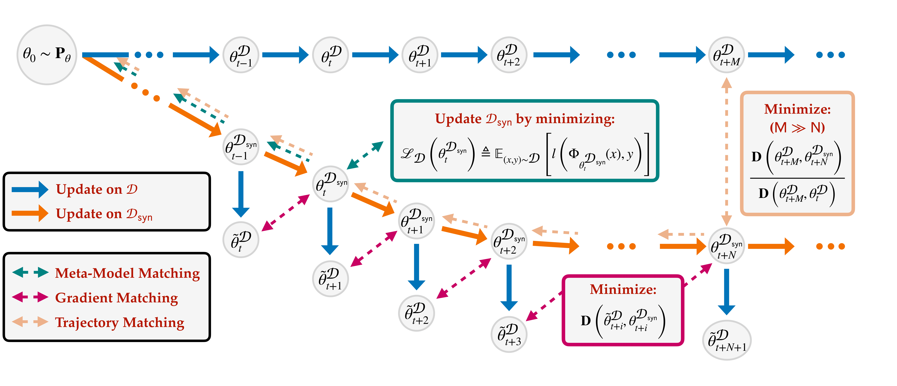

# Differentially Private Data Distillation Federated Learning Literature Review

## Data-Distillation
* [Data-Distillation survey](https://arxiv.org/pdf/2301.04272.pdf)

  * Performance, Efficiency, Transferability.
  * NTK of a given neural network, is equivalent to training the same ∞-width neural network with L2 reconstruction loss for ∞ SGD-steps
  * Meta-model Matching: RFAD proposes NNGP: lightweight + can be DP
  * Gradient Matching:
* [Private Set Generation with Discriminative Information](https://arxiv.org/pdf/2211.04446.pdf)
  * Class-agnostic distillation and DP
  * one round distillation

## Data-syn/Distillation for FL
* [Federated Learning via Synthetic Data](https://arxiv.org/pdf/2008.04489.pdf)
  * norm of the true local update H and Synthetic data D are communicated
  * "After every round, to test the quality of our induced update g, we calculate the cross entropy loss on our the client’s training data set. We keep track of the synthetic data which induces the lowest cross entropy loss, using this loss to define our ‘best’ synthetic data."
* [DYNAFED: Tackling Client Data Heterogeneity with Global Dynamics](https://arxiv.org/pdf/2211.10878.pdf)
  * Firstly, we collect a trajectory of the global model’s updates in the early phase of federated training, with which we construct a synthetic dataset
  * Our goal is to construct a pseudo dataset Dsyn, which achieves a similar effect during training as the global dataset D
  * The data synthesis only needs to be conducted once.
  * not DP? => can be dp
* [FedSynth: Gradient Compression via Synthetic Data in Federated Learning](https://arxiv.org/pdf/2204.01273.pdf)
  * Motivated by FedAVG, we allow client k to create multiple batches of synthetic data. Instead of running one step gradient descent on the entire synthetic data, client k updates wt k sequentially using different batches of synthetic data
  * Trainable label
* [Meta Knowledge Condensation for Federated Learning](https://arxiv.org/pdf/2209.14851.pdf)
  1. At first, on an active client c, we update the model parameter
  2. Update condensed meta knowledge
     * Dynamic Weight Assignment, and Meta Knowledge Sharing.
  3. the uploaded meta knowledge is used as normal training data to train a global model.
  4. The trained generator G models the distribution of uploaded meta knowledge
  5. The generated "pseudo" meta knowledge D_pseu as well as uploaded D are utilized to train the global model
* [Distilled One-Shot Federated Learning](https://arxiv.org/pdf/2009.07999.pdf)
  1. A central server randomly initializes model parameters' theta_0. This can be distributed to the clients as a random seed.
  2. The clients distill their datasets.
  3. The clients upload the distilled data to the server.
  4. The server then trains its own model on the combined sequence.
* [Federated Learning via Decentralized Dataset Distillation in Resource-Constrained Edge Environments](https://arxiv.org/pdf/2208.11311.pdf)
  * distill the decentralized datasets
  * Coreset-based Methods
  * KIP-based Methods
  * Gamma Communication Efficiency(GCE)
    * tackle the trade-off between model performance and required communication cost
* [An experimental study on private aggregation of teacher ensemble learning for end-to-end speech recognition](https://assets.amazon.science/7c/58/a63db89c4c3c8b0a9a4ec6f51180/an-experimental-study-on-private-aggregation-of-teacher-ensemble-learning-for-end-to-end-speech-recognition.pdf)
  * Knowledge-Distillation and Ensemble
  * Average gradients + DP > DP-SGD?
* [Fed-GLOSS-DP: Federated, Global Learning using Synthetic Sets with Record Level Differential Privacy](https://arxiv.org/pdf/2302.01068.pdf)
  * Class-agnostic distillation and record-level DP
  * multiple-round FL
  * privacy-preserving learning that uses synthetic data to train federated models
  * simulate the global optimization by transmitting a small set of synthetic samples that reflect the local loss landscapes
  * (Eq. 13) w_k that is sufficiently close to the initial point of the local update, NTK condition, no change + always in the right direction => novelty
    * NTK network doesn't need to be shared / has to be uniform?
    
  Questions
    * the weights are synchronized/ communicated between client and central. A: no DP leak as its sanitized
    * minimizing the distance between gradients => NTK? MMD

### Distribution Matching

* [FedDM: Iterative Distribution Matching for Communication-Efficient Federated Learning](https://arxiv.org/pdf/2207.09653.pdf)
  * DP via clipped gradient and GM 
